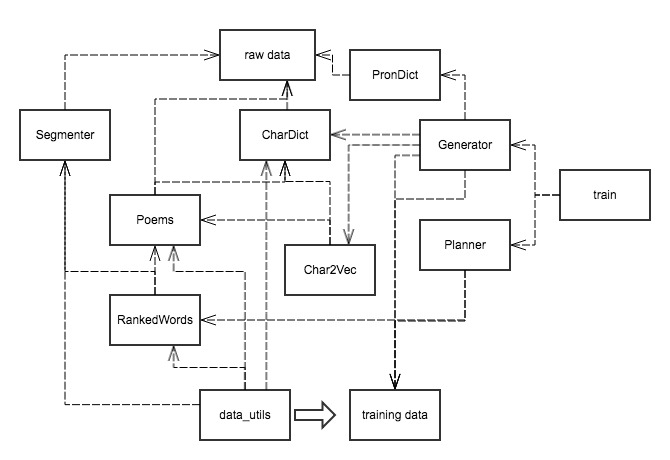

# Planning-based Poetry Generation

A classical Chinese quatrain generator based on the RNN encoder-decoder framework.

Here I tried to implement the planning-based architecture purposed in 
[Wang et al. 2016](https://arxiv.org/abs/1610.09889),
whereas technical details might be different from the original paper.
My purpose of making this was not to refine the neural network model and give better results by myself.
Rather, I wish to <b>provide a simple framework as said in the paper along with
convenient data processing toolkits</b> for all those who want to experiment their
ideas on this interesting task.

By Jun 2018, this project has been refactored into Python3 using TensorFlow 1.8.

## Code Organization

The diagram above illustrates major dependencies in
this codebase in terms of either data or functionalities.
Here I tried to organize code around data,
and make every data processing module a singleton at runtime.
Batch processing is only done when the produced result
is either missing or outdated.

## Dependencies

* Python 3.6.5

* [Numpy 1.14.4](http://www.numpy.org/)

* [TensorFlow 1.8](https://www.tensorflow.org/)

* [Jieba 0.39](https://github.com/fxsjy/jieba)

* [Gensim 2.0.0](https://radimrehurek.com/gensim/)

## Data Processing

Run the following command to generate training data from source text data:

    ./data_utils.py

Depending on your hardware, this can take you a cup of tea or over one hour.
The keyword extraction is based on the TextRank algorithm,
which can take a long time to converge.

## Training

The poem planner was based on Gensim's Word2Vec module.
To train it, simply run:

    ./train.py -p

The poem generator was implemented as an enc-dec model with attention mechanism.
To train it, type the following command:

    ./train.py -g

You can also choose to train the both models altogether by running:

    ./train.py -a

To erase all trained models, run:

    ./train.py --clean

As it turned out, the attention-based generator model after refactor
was really hard to train well.
From my side, the average loss will typically stuck at ~5.6
and won't go down any more.
There should be considerable space to improve it.

## Run Tests

Type the following command:

    ./main.py

Then each time you type in a hint text in Chinese,
it should return a kind of gibberish poem.
It's up to you to decide how to improve the models and training methods
to make them work better.

## Improve It

* To add data processing tools, consider adding dependency configs into
\_\_dependency\_dict in [paths.py](./paths.py).
It helps you to automatically update processed data when it goes stale.

* To improve the planning model,
please refine the planner class in [plan.py](./plan.py).

* To improve  the generation model,
please refine the generator class in [generate.py](./generate.py).

