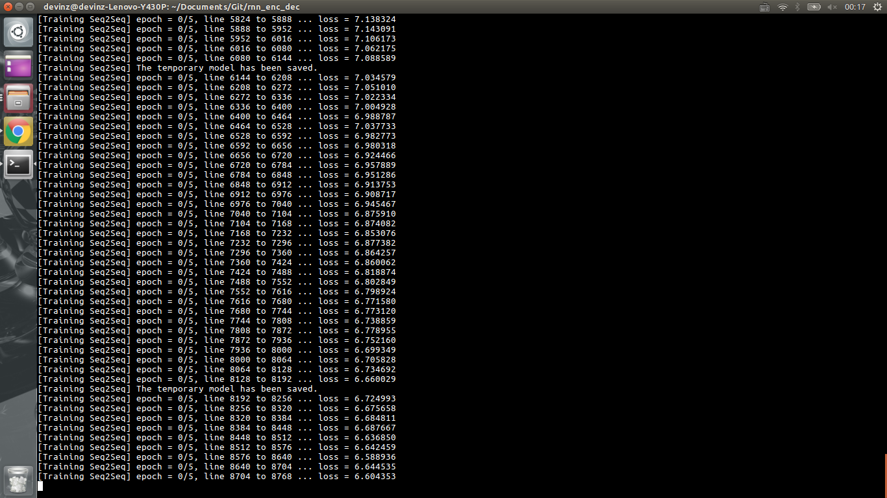

# RNN-Based Poem Generator

A classical Chinese quatrain generator based on the RNN encoder-decoder framework.

Two 4-layer LSTM networks are used as encoder and decoder respectively.
The encoder takes as input four keywords provided by a poem planner,
and the decoder generates a quatrain character by character.

The original repository is [here](https://github.com/DevinZ1993/Chinese-Poetry-Generation), 
where there are also a bunch of raw data files necessary to train the model.
The raw data files were downloaded from the Internet, mostly from similar open source projects.

    raw/
    ├── ming.all
    ├── pinyin.txt
    ├── qing.all
    ├── qsc_tab.txt
    ├── qss_tab.txt
    ├── qtais_tab.txt
    ├── qts_tab.txt
    ├── shixuehanying.txt
    ├── stopwords.txt
    └── yuan.all

## Dependencies

Python 2.7

[TensorFlow 1.0](https://www.tensorflow.org/)

[Jieba 0.38](https://github.com/fxsjy/jieba)

[Gensim 2.0.0](https://radimrehurek.com/gensim/)

## Training

To begin with, you should process the raw data to generate the training data:

    python data_utils.py

The TextRank algorithm may take many hours to run.
Instead, you could choose to stop it early by typing ctrl+c to interrupt the iterations,
when the progress shown in the terminal has remained stationary for a long time.

Then, generate the word embedding data using gensim Word2Vec model:

    python word2vec.py

Now, type the following command and wait for several hours:

    python train.py

## Run Tests

Start the user interaction program in a terminal once the training has finished:

    python main.py

Type in an input sentence each time and the poem generator will create a poem for you.

